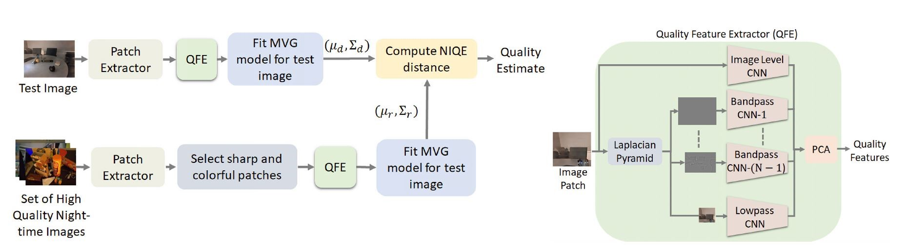

# <p align="center">Quality Assessment of Low-light Restored Images: A Subjective Study and an Unsupervised Model</p>
<p align="center">
Vignesh Kannan, Sameer Malik, Nithin Babu and Rajiv Soundararajan
</p>

<p align="center">
<a> DSLR Dataset and Official Pytorch Code of the IEEE Access 2023 paper:</a><br>

<p align="center">
<a href="https://ieeexplore.ieee.org/stamp/stamp.jsp?tp=&arnumber=10172189">Quality Assessment of Low-light Restored Images: A Subjective Study and an Unsupervised Model</a>

<p align="center">
<a href="http://ece.iisc.ac.in/~rajivs/databases/DSLR.zip">Link to DSLR Dataset</a>
  
<p align="center">
<a href="https://docs.google.com/forms/d/e/1FAIpQLSfMO2dSZPTldyyHKoa5I4fYKleR5WtaHYYVukip-9NtKpi8OA/viewform?usp=sf_link">Form to receive password to Dataset ZIP file</a>


</p>




## Training

To train the model, run the following:
```
bash runtrain.sh

```
### Testing 
Testing code for evaluating the M-SCQALE model.
```
python EVAL.py

```

## Citation
If you find this work useful for your research, please cite our paper:
```
@ARTICLE{10172189,
  author={Kannan, Vignesh and Malik, Sameer and Babu, Nithin C. and Soundararajan, Rajiv},
  journal={IEEE Access}, 
  title={Quality Assessment of Low-Light Restored Images: A Subjective Study and an Unsupervised Model}, 
  year={2023},
  volume={11},
  number={},
  pages={68216-68230},
  doi={10.1109/ACCESS.2023.3292114}}
